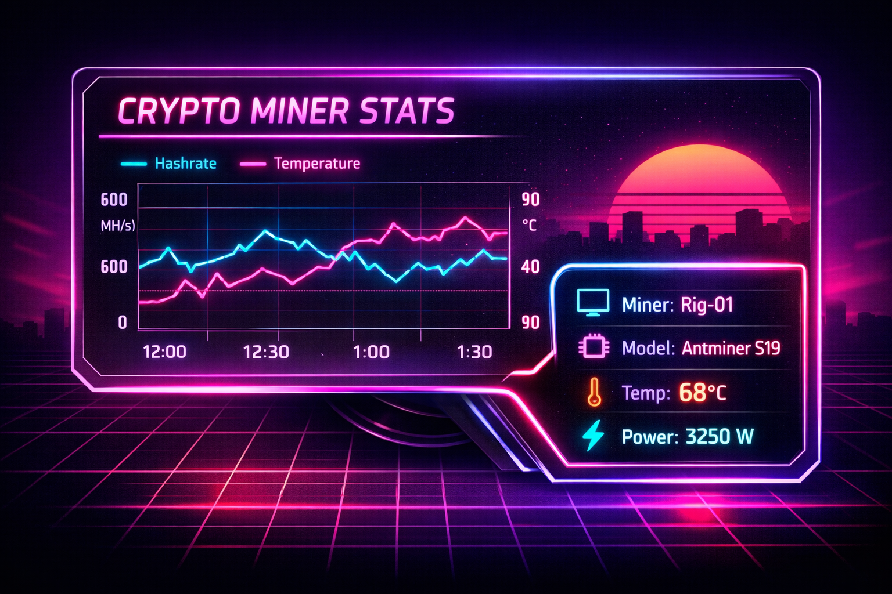

# Bitcoin Miner Card

A custom Lovelace card for Home Assistant focused on monitoring Bitcoin miner telemetry.



## Features

- Neon-styled miner status card.
- Configurable entities for hashrate, temperature, power, and model
- State-driven overheat overlay that appears when temperature exceeds threshold
- Built-in Home Assistant visual configuration support


## Installation

### HACS (recommended)

1. In Home Assistant, go to HACS.
2. Open the menu, then select Custom repositories.
3. Add this repository URL and choose category Dashboard.
4. Install Bitcoin Miner Card.
5. Restart Home Assistant.

## Lovelace Configuration

```yaml
type: custom:bitcoin-miner-card
title: Crypto Miner Stats
miner_name: Rig-01
miner_name_entity: sensor.rig_01_name
hashrate_entity: sensor.rig_01_hashrate
temperature_entity: sensor.rig_01_temperature
power_entity: sensor.rig_01_power
model_entity: sensor.rig_01_model
overheat_threshold: 85
show_overheat: true
# Optional override paths (defaults point to bundled assets next to the card JS)
# base_image: /local/community/bitcoin-miner-card/base-layer.png
```

